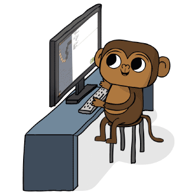

<p align="center">
  
</p>

<h1 align="center">👋 Hi, I'm Sackey Ezekiel Etrue (🏄‍♂️ Zeke Cora) </h1>
<div align="center">
  <h3>🚀 Software Engineer | 📥 Computer Science Enthusiast (Developer/Creator/Achiever/Maker)</h3>
</div>

<div align="center">
  <a href="https://instagram.com/djoezeke">
    
  </a>
  <a href="https://linkedin.com/in/djoezeke">
    
  </a>
  <a href="https://youtube.com/djoezeke">
    
  </a>
  <a href="https://twitter.com/djoezeke">
     </a>
</div>

Welcome to my GitHub portfolio! Here, you'll find projects that showcase my skills in software development,
problem-solving, and algorithm design.

#### 👨🏻‍💻 About Me

🎓**Education:** Computer Science Student at Accra Technical University
🚀**Interests:** Game/Web Development, Algorithms, Open-Source Contributions



- 🏫 I'm a Computer Science Student at Accra Technical University
- 🔭 I’m currently working on **Graphics Development**
- I have a ❤️**love** relationship with **Programming**
- 🌱 I’m currently Working with my self **OpenGL**
- 🤔 I’m looking for help with Data Structures and Algorithms 😭
- 💬 Ask me about anything, I am happy to help
- 😄 Pronouns: **Maker** ,**Leader** and a **Coder**
- 🏫 I'm a Computer Science Student at Accra Technical University
- 🔭 I’m currently working on **Graphics Development**
- I have a ❤️**love** relationship with **Programming**
- 🌱 I’m currently Working with my self **OpenGL**
- 🤔 I’m looking for help with Data Structures and Algorithms 😭
- 💬 Ask me about anything, I am happy to help
- 😄 Pronouns: **Maker** ,**Leader** and a **Coder**
- 😄 Pronouns: **Maker** ,**Leader** and a **Coder**

<hr>
<!-- ------------------------------------------------------------------------------------------------------------ -->

## 🔥 Languages and Tools

<table>
  <tr>
    <td valign="top" width="33%">
      <h3>Languages</h3>
      <div align="center">
        <a href="https://www.cprogramming.com/" target="_blank">
          
        </a>
        <a href="https://www.cplusplus.com/" target="_blank">
          
        </a>
        <a href="https://www.python.org/" target="_blank">
          
        </a>
        <a href="https://en.wikipedia.org/wiki/HTML5" target="_blank">
          
        </a>
        <a href="https://www.w3schools.com/css/" target="_blank">
          
        </a>
        <a href="https://www.javascript.com/" target="_blank">
          
        </a>
      </div>
    </td>
    <td valign="top" width="33%">
      <h3>Frameworks & Libraries</h3>
      <div align="center">
        <a href="https://www.djangoproject.com/" target="_blank">
          
        </a>
        <a href="https://flask.palletsprojects.com/" target="_blank">
          
        </a>
        <a href="https://jquery.com/" target="_blank">
          
        </a>
      </div>
    </td>
    <td valign="top" width="33%">
      <h3>🧰Toolbox</h3>
      <div align="center">
        <a href="https://www.linux.org/" target="_blank">
          
        </a>
        <a href="https://github.com/" target="_blank">
          
        </a>
        <a href="https://www.gnu.org/software/bash/" target="_blank">
          
        </a>
        <a href="https://www.docker.com/" target="_blank">
          
        </a>
        <a href="https://www.mysql.com/" target="_blank">
          
        </a>
        <a href="https://www.postgresql.org/" target="_blank">
          
        </a>
        <a href="https://www.mongodb.com/" target="_blank">
          
        </a>
        <a href="https://www.selenium.dev" target="_blank">
          
        </a>
        <a href="https://www.sqlite.org/" target="_blank">
          
        </a>
      </div>
    </td>
  </tr>
</table>

<hr>
<!-- ------------------------------------------------------------------------------------------------------------ -->

## 🔥 Activities

### 📊 **This week i spent my time on:**

```txt
C ------------- 16 hrs 03 mins : ███████████████████▓░░░░░░░░░░ 78.42 %
C++ ----------- 03 hrs 58 mins : █████░░░░░░░░░░░░░░░░░░░░░░░░░ 19.42 %
Python -------- 03 hrs 58 mins : █████░░░░░░░░░░░░░░░░░░░░░░░░░ 19.42 %
HTML ---------- 00 hrs 11 mins : ▒░░░░░░░░░░░░░░░░░░░░░░░░░░░░░ 00.91 %
Javascript ---- 00 hrs 04 mins : ░░░░░░░░░░░░░░░░░░░░░░░░░░░░░░ 00.38 %
```

### 📊 **Working**

### 📊 **Trending**

<hr>
<!-- ------------------------------------------------------------------------------------------------------------ -->

## 🗂️ Featured Projects </h2>

### 📌 Personal

<p align="center">
  <a href="https://github.com/djoezeke/cprofiler">
    
  </a>

  <a href="https://github.com/djoezeke/GLFWTem">
    
  </a>
</p>

<p align="center">
  <a href="https://github.com/djoezeke?tab=repositories&sort=stargazers">
    
  </a>
</p>

### 📌 Public

<p align="center">
  <a href="https://github.com/djoezeke/pugixml">
    
  </a>
  <a href="https://github.com/djoezeke/first-contributions">
    
  </a>
</p>
<p align="center">
  <a href="https://github.com/djoezeke?tab=repositories&q=&type=fork&language=&sort=stargazers">
    
  </a>
</p>

<hr>
<!-- ------------------------------------------------------------------------------------------------------------ -->

## 📈 GitHub Stats & History

<a href="https://github.com/djoezeke">
  
</a>

<a href="https://github.com/djoezeke">
  
</a>

<a href="https://github.com/djoezeke">
  
</a>

<a href="https://github.com/djoezeke">
  
</a>
<a href="https://github.com/djoezeke">
  
</a>

### 🏆 GitHub Trophies


<picture>
  <source media="(prefers-color-scheme: dark)"
    srcset="https://raw.githubusercontent.com/djoezeke/djoezeke/output/github-contribution-grid-snake-dark.svg" />
  <source media="(prefers-color-scheme: light)"
    srcset="https://raw.githubusercontent.com/djoezeke/djoezeke/output/github-contribution-grid-snake.svg" />
  
</picture>

<div align="center">
  
</div>

<!-- ------------------------------------------------------------------------------------------------------------ -->

### 🙋‍♂️ More About Me

- 🥖 I'm Ghanaian! And I love Music 🎶
- 👨‍💻 [djoezeke.com]()
- 📫 You can contact me at **sackeyetrue@gmail.com**
- 🎈 Fun fact: _I love building things_

## 📜 Resume & Additional Links

📄 [Resume](djoezeke.com)
👨‍💻 [djoezeke.com](https://djoezeke.com)

Feel free to explore my repositories and reach out if you’d like to collaborate! 🚀

<p align="center">
  
</p>
